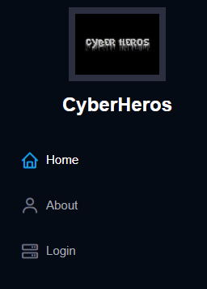
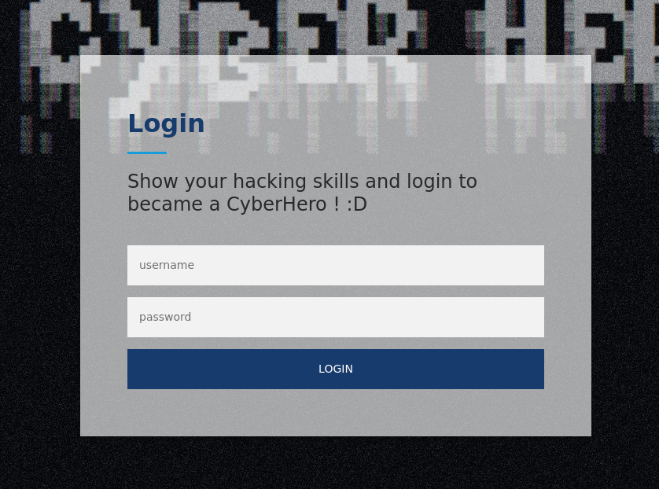
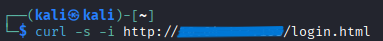
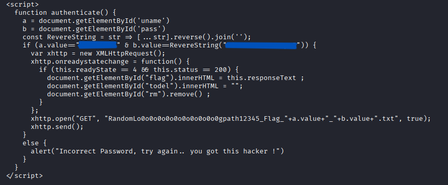
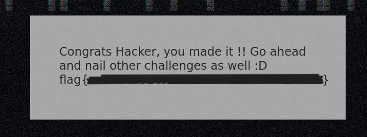

# CyberHeroes — TryHackMe Writeup


🔗 **Sala:** [tryhackme.com/room/cyberheroes](https://tryhackme.com/room/cyberheroes)

## 📋 Visão Geral

> A sala CyberHeroes é um desafio de nível *Easy* que exige encontrar uma forma
> de logar em um site fictício explorando falhas de autenticação client-side,
> ou seja, lógica de validação implementada no próprio navegador
> em vez de no servidor.

**Objetivo:** Conseguir logar no site e capturar a flag.

## 🛠️ Ferramentas Utilizadas

- Navegador/DevTools
- Linha de comando do Kali Linux
- cURL

## 🔍 Reconhecimento

O primeiro passo foi navegar pelas páginas do site para identificar se na URL apareceria alguma brecha relevante.

Comecei entrando nas páginas do menu lateral esquerdo. A mais interessante, e, nosso alvo, é a página de login:

📸





Testei um usuário e uma senha aleatórios para verificar se dava algum erro.


A mensagem apenas indicava que o login estava incorreto.

## 🕵️ Enumeração

Não foi possível identificar informações ou brechas relevantes apenas navegando diretamente nas páginas da aplicação.

Para ter mais detalhes da página de login, acessei o cabeçalho e corpo da página através do comando curl no Kali Linux:

```bash
curl -s -i http://<IP_DO_ALVO>/login.html
```

- -s (silent), reduz a saída relacionada ao progresso de requisição, é mais direto.
- -i inclui os headers HTTP juntamente com o corpo da resposta.

📸



Após isto, verifiquei que no corpo do HTML há um trecho com uma função em JavaScript.

Esta função possui dois valores, a (uname) e b (pass), que nos indicam uma possível credencial de login.

Além disto, a função também entrega uma condição entre a e b. Nesta condição está o nome de usuário e a senha para login.

📸


Um detalhe interessante no valor de b, é o fato de estar com o método .reverse() para inverter a sequência de caracteres antes da comparação.

## 💥 Exploração

Após utilizar as credenciais disponibilizadas no bloco, o login é realizado e a flag é informada.

Não foi necessário usar mais nenhum outro método, apenas a verificação do código-fonte da página.

📸



⚠️ Por respeito às diretrizes do TryHackMe, o IP da máquina alvo, as credenciais de login e a flag estão tampados!

**Impacto**

O principal problema foi a exposição da lógica de autenticação no código enviado ao cliente.

Qualquer informação necessária para autenticar um usuário não deve estar guardada no lado do cliente. O código JavaScript entregue ao navegador pode ser inspecionado pelo próprio usuário.

## 📚 Aprendizados

- Enumerar serviços antes de iniciar a exploração.
- Analisar o código-fonte das aplicações web.
- Utilizar curl no lugar de inspecionar código no próprio navegador para obter e analisar respostas HTTP diretamente.
- Identificar informações sensíveis expostas no lado do cliente.

## ✅ Conclusão

Esta sala ensinou que uma vulnerabilidade crucial pode estar aberta para qualquer pessoa explorar.
No mundo real, essa vulnerabilidade permite que qualquer usuário realize um login com credenciais que não são suas.

---
