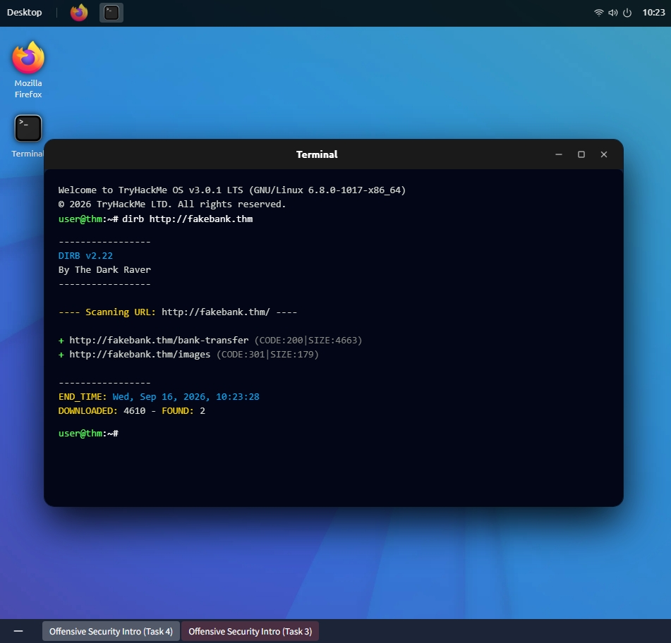
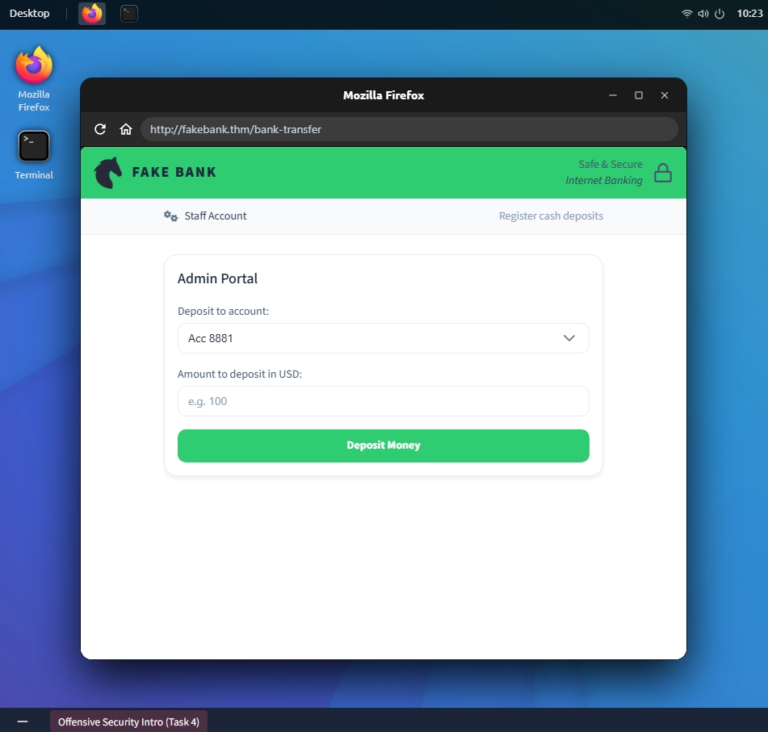

# Offensive Security Intro — TryHackMe Writeup


🔗 **Sala:** [tryhackme.com/room/offensivesecurityintro](https://tryhackme.com/room/offensivesecurityintro)

## 📋 Visão Geral

**Objetivo:** Identificar e explorar uma vulnerabilidade na aplicação web simulada FakeBank.

**Alvo:** `http://fakebank.thm`

Todas as atividades foram realizadas exclusivamente dentro do ambiente de laboratório autorizado do TryHackMe.

## 🔍 Reconhecimento

O primeiro passo foi identificar recursos disponíveis na aplicação web alvo, utilizando a ferramenta **DIRB** para enumeração de diretórios.

```bash
dirb http://fakebank.thm
```

A enumeração identificou os seguintes recursos:

- `http://fakebank.thm/bank-transfer`
- `http://fakebank.thm/image`

📸 

## 🕵️ Enumeração

O endpoint `/bank-transfer` foi investigado por seu nome indicar uma função financeira potencialmente sensível.

O endpoint expôs um **Admin Portal** contendo funcionalidade para realizar transferências bancárias, sem qualquer controle de autenticação visível.

📸 

## 💥 Exploração

A aplicação exibia inicialmente um saldo negativo na conta: `-$1,232.32`.

A funcionalidade administrativa descoberta permitiu a criação de uma transferência. Foi realizada uma transferência de `$5,000.00` para a própria conta, dentro do ambiente do laboratório.

A aplicação aceitou a operação e o saldo foi modificado.

> ⚠️ O saldo exibido na interface não refletiu a mudança imediatamente — provavelmente um bug da própria aplicação de simulação, não relacionado à exploração em si.

## 💣 Impacto

Em uma aplicação real, o acesso não autorizado a uma função de transferência financeira poderia resultar em:

- Transações não autorizadas
- Perda financeira
- Alteração de registros financeiros
- Comprometimento da integridade dos dados

## 🔗 Cadeia de Ataque

```
Enumeração de diretórios
        ↓
Descoberta de endpoint
        ↓
/bank-transfer
        ↓
Admin Portal
        ↓
Funcionalidade de transferência
        ↓
Transação bem-sucedida
```

## 🛡️ Mitigação

- Autenticação forte para funções administrativas
- Autorização adequada e controle de acesso baseado em papéis (RBAC)
- Validação server-side de operações financeiras
- Restrição de acesso a endpoints administrativos
- Registro e monitoramento de transações sensíveis
- Separação entre funcionalidades administrativas e de usuário comum

> Ocultar uma URL administrativa não é, por si só, um controle de segurança.

## 📚 Aprendizados

- Superfície de ataque pode ser descoberta por enumeração de diretórios, mesmo sem estar visível na interface
- Funcionalidades administrativas expostas sem controle de acesso representam risco crítico
- Controle de acesso é tão importante quanto a autenticação

## ✅ Conclusão

Esta sala apresentou o fluxo básico de uma avaliação de segurança web: reconhecimento → enumeração → descoberta → exploração → impacto → mitigação.

A principal lição foi que funcionalidades não expostas na interface visível de uma aplicação ainda podem estar acessíveis através de endpoints diretamente descobertos.

## 🧰 Ferramentas

| Ferramenta | Finalidade |
|---|---|
| DIRB | Enumeração de diretórios e recursos |
| Navegador | Análise e interação com a aplicação |
| Terminal | Execução de comandos |

---